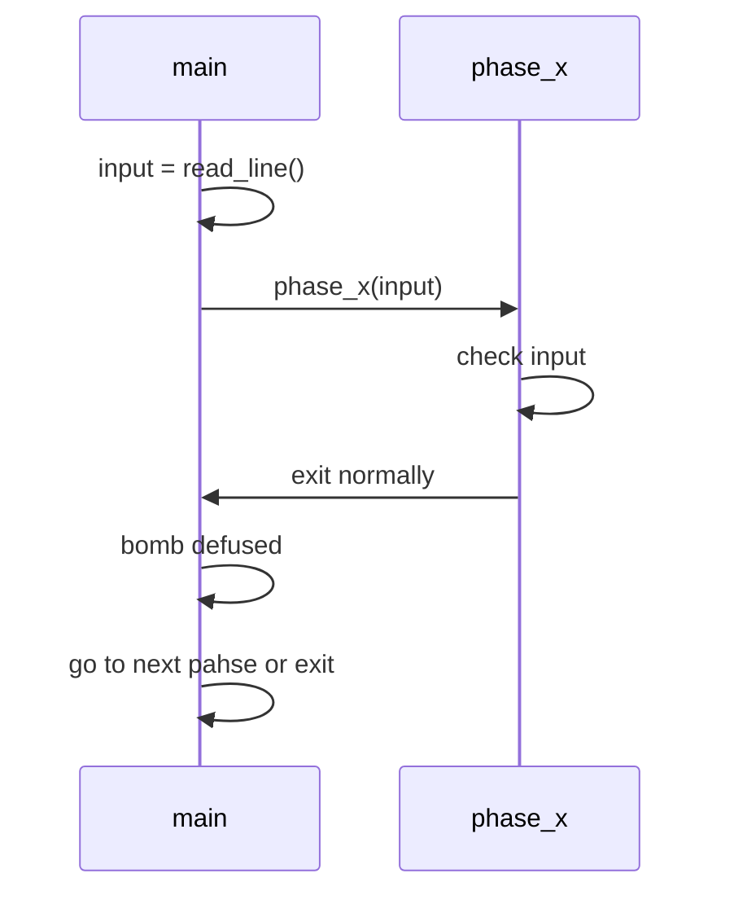

## 前言

最近在过 CSAPP，花了两天时间看了看《程序的机器级表示》，俺深知硬看 x86_64 那个用🦶🏻写出来（$金^3$学长语）的 Register 和 ASM 是学不会滴。如果学不会的话，成为成功人士的道路就中断了罢；对了，那就整个很难的 Lab 掩盖过去罢！

## 概览

拿到工程文件，解压一看，一 Note，一源文件，一二进制而已：

```bash
$ ls -l
.rwxr-xr-x  bomb
.rw-r--r--  bomb.c
.rw-r--r--  note.md
```

note 中莫得任何可用信息，bomb.c 交代了大致逻辑，无非是：



一眼看过去大概有 6 个 Phase，Phase 里面具体是个啥都在 .h 文件里面了，然而 .h 文件缺失了。于是只能上手 Reversing ？

## 工具

先动手跑一跑看看具体有甚么。

```bash
$ ./bomb
Welcome to my fiendish little bomb. You have 6 phases with
which to blow yourself up. Have a nice day!
# 毫无头绪，ctrl-c 退了退了～
^CSo you think you can stop the bomb with ctrl-c, do you?
Well...OK. :-)
```

可以使用 Object Dump 生成具体的 ASM 到文本文件

```bash
objdump -D ./bomb > bomb.asm
```

可以使用 ~~radare2~~ CGDB 进行拆弹。CGDB 的资料[在此](https://cgdb.github.io/docs/cgdb-split.html)——当然如果你的英语和我一样烂的话也可以看[中文版](https://github.com/leeyiw/cgdb-manual-in-chinese)

## Phase 1

> Welcome to my fiendish little bomb. You have 6 phases with which to blow yourself up. Have a nice day!

观察 asm 文件中的 phase_1 过程：

```NASM
0000000000400ee0 <phase_1>:
  400ee0:	48 83 ec 08          	sub    $0x8,%rsp
  400ee4:	be 00 24 40 00       	mov    $0x402400,%esi
  400ee9:	e8 4a 04 00 00       	call   401338 <strings_not_equal>
  400eee:	85 c0                	test   %eax,%eax
  400ef0:	74 05                	je     400ef7 <phase_1+0x17>
  400ef2:	e8 43 05 00 00       	call   40143a <explode_bomb>
  400ef7:	48 83 c4 08          	add    $0x8,%rsp
  400efb:	c3                   	ret    
```

我们可以发现一个奇怪的地址 `0x402400`，这个过程将该地址塞进了 `%esi` 中，然后调用了 `strings_not_equal`。

但是 `%rsi` 是第二个参数，那么第一个参数是什么呢？第一个参数是 `%rdi`，也就是我们向 `phase_1` 传入的参数，即变量 `input`，字符串的起始地址。

也就是说，phase_1 调用了 strings_not_equal(input, 0x402400)，比较的结果返回到 %eax，然后使用 TEST 指令。如果 TEST 的结果为 ZF==0，那么就会跳转到 0x400ef7，自然就完成拆弹了。

所以我们可以查看 0x402400 的具体内容，想必是个字符串罢。

```text
(gdb)x/s 0x402400
0x402400:        "Border relations with Canada have never been better."
```

拿到 ~~flag~~ 字符串，走人。

> Phase 1 defused. How about the next one?

## Phase 2

看看 ASM？Emmm?

```NASM
0000000000400efc <phase_2>:
  400efc:	55                   	push   %rbp
  400efd:	53                   	push   %rbx
  400efe:	48 83 ec 28          	sub    $0x28,%rsp
  400f02:	48 89 e6             	mov    %rsp,%rsi
  400f05:	e8 52 05 00 00       	call   40145c <read_six_numbers>
  400f0a:	83 3c 24 01          	cmpl   $0x1,(%rsp)
  400f0e:	74 20                	je     400f30 <phase_2+0x34>
```

注意 %rsp 复制到了 %rsi。

read_six_numbers? 让我看看！

```NASM
000000000040145c <read_six_numbers>:
  40145c:	48 83 ec 18          	sub    $0x18,%rsp
  401460:	48 89 f2             	mov    %rsi,%rdx
  401463:	48 8d 4e 04          	lea    0x4(%rsi),%rcx
  401467:	48 8d 46 14          	lea    0x14(%rsi),%rax
  40146b:	48 89 44 24 08       	mov    %rax,0x8(%rsp)
  401470:	48 8d 46 10          	lea    0x10(%rsi),%rax
  401474:	48 89 04 24          	mov    %rax,(%rsp)
  401478:	4c 8d 4e 0c          	lea    0xc(%rsi),%r9
  40147c:	4c 8d 46 08          	lea    0x8(%rsi),%r8
  401480:	be c3 25 40 00       	mov    $0x4025c3,%esi
  401485:	b8 00 00 00 00       	mov    $0x0,%eax
  40148a:	e8 61 f7 ff ff       	call   400bf0 <__isoc99_sscanf@plt>
  40148f:	83 f8 05             	cmp    $0x5,%eax
  401492:	7f 05                	jg     401499 <read_six_numbers+0x3d>
  401494:	e8 a1 ff ff ff       	call   40143a <explode_bomb>
  401499:	48 83 c4 18          	add    $0x18,%rsp
  40149d:	c3                   	ret    
```

这个过程首先给 rsp - 0x18，也就是申请了 16 + 8 = 24 bytes 的栈空间，联想到这个函数的名字是“读六个数”，显然是读 6 个 int 进来。下面 0x40148a 调用了 sscanf，应当是读取 6 个数字的函数。如果是和我一样用惯了 `iosteam` 的 C with Class 人可以上网查询 sscanf 的函数签名：

```C
int sscanf(const char *str, const char *format, ...)
```

这个函数从第一个参数 `*str` 读取内容，依靠 `*format` 作为匹配模版，将匹配得到的结果赋值给后面的参数，返回匹配到的值的个数。

可知第一个参数是 `%rdi`，也就是输入的字符串；自然是看 %rsi 了，在 0x401480 给 %rsi 赋值了 0x4025c3，一看内容不出所料的是“%d %d %d %d %d %d”，匹配 6 个数字。接下来将返回值和 5 相比，可知输入数字数目必须等于 6。否则炸弹会爆炸。

剩下的参数就是匹配到的数字了。这整个过程中，数字的去向如下：

| 输入顺序 | 参数位置 | 地址寄存器 | 栈上位置 |
| :---: | :--: | :---: | :---: |
| 1 | arg3 | rdx | %rsi |
| 2 | arg4 | rcx | %rsi + 0x4 |
| 3 | arg5 | r8 | %rsi + 0x8 |
| 4 | arg6 | r9 | %rsi + 0xC |
| 5 | arg7 | (%rsp) | %rsi + 0x10  |
| 6 | arg8 | (%rsp) + 0x8 | %rsi + 0x14 |

按顺序叫这些数 num1 ~ num6 好了。

然后继续看 Phase_2 的 asm:

```NASM
  400f0a:	83 3c 24 01          	cmpl   $0x1,(%rsp)
  400f0e:	74 20                	je     400f30 <phase_2+0x34>
  400f10:	e8 25 05 00 00       	call   40143a <explode_bomb>
  400f15:	eb 19                	jmp    400f30 <phase_2+0x34>
  400f17:	8b 43 fc             	mov    -0x4(%rbx),%eax
  400f1a:	01 c0                	add    %eax,%eax
  400f1c:	39 03                	cmp    %eax,(%rbx)
  400f1e:	74 05                	je     400f25 <phase_2+0x29>
  400f20:	e8 15 05 00 00       	call   40143a <explode_bomb>
  400f25:	48 83 c3 04          	add    $0x4,%rbx
  400f29:	48 39 eb             	cmp    %rbp,%rbx
  400f2c:	75 e9                	jne    400f17 <phase_2+0x1b>
  400f2e:	eb 0c                	jmp    400f3c <phase_2+0x40>
  400f30:	48 8d 5c 24 04       	lea    0x4(%rsp),%rbx
  400f35:	48 8d 6c 24 18       	lea    0x18(%rsp),%rbp
  400f3a:	eb db                	jmp    400f17 <phase_2+0x1b>
  400f3c:	48 83 c4 28          	add    $0x28,%rsp
  400f40:	5b                   	pop    %rbx
  400f41:	5d                   	pop    %rbp
  400f42:	c3                   	ret    
```

容易得到 num1 应当为 1。接下来：

1. 跳到 400f30 将 %rsp+0x4 (&num2) 赋值给 %rbx，%rsp + 0x18 赋值给 %rbp。
2. 跳到 400f17 将 (%rsp) (num1) 赋值给 %eax，从下面的比较可知要求 2*num1 == num2，可知 num2 == 2。
3. 跳到 400f25，%rbx += 4 变为 &num3，显然和 rbp 不相等，跳到 400f17；

    可以知道，这是一个 do-while 型的循环结构。每一个数字都应该是前一个数字的两倍。
4. 当 %rbx == %rbp - 4 时，跳出循环。

于是得到各个地址对应的值：

| 地址 | 数字 | 值 |
| :--: | :--: | :--: |
| %rsp | num1 | 1 |
| %rsp + 0x4 | num2 | 2 |
| %rsp + 0x8 | num3 | 4 |
| %rsp + 0xc |num4| 8 |
| %rsp + 0x10 |num5| 16 |
| %rsp + 0x14 |num6| 32 |

所以 flag 为：

```text
1 2 4 8 16 32
```

> That's number 2.  Keep going!

## Phase_3
