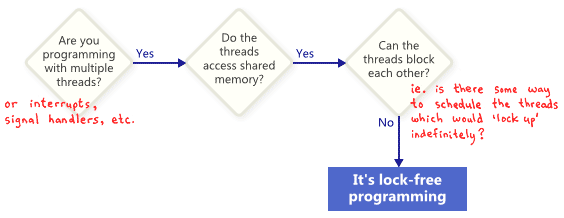
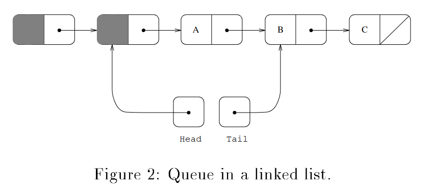

在写毕设的时候总会在 crates.io、docs.io 等网站转悠，查询有没有高性能的缓存实现可以稍微拉高一点毕设性能。而在琳琅满目的第三方缓存库中，总有一些库打出“无锁”的招牌，好像用到了无锁并发编程技术性能就有质的飞跃一般。不过一直没有亲自去学习应用这些技术到自己写的数据结构中——毕竟套个 Mutex，讲究一点套个 RwLock，也就20秒的事。😏

而最近面试某司时，面试官出了一个使用 Rust 写无锁链表队列的面试题。其实说到底也就一个链表罢，俺这么想着，便打开了面试官发来的论文[^lockless]开始阅读。

[^lockless]: J. D. Valois, ‘Implementing Lock-Free Queues’, *In Proceedings of the Seventh International Conference on Parallel and Distributed Computing Systems, Las Vegas*, NV, 1994. pp.64–69.

## 什么是无锁


“无锁”与“有锁”相对，指的是不适用互斥锁，而是基于 CPU 提供的 [Compare and Swap](https://zh.m.wikipedia.org/zh-hans/%E6%AF%94%E8%BE%83%E5%B9%B6%E4%BA%A4%E6%8D%A2)、[Fetch and Add](https://zh.m.wikipedia.org/zh-hans/Fetch-and-add) 等原子操作，直接实现并发数据结构的方法。有锁数据结构的主要缺点有：
- 阻塞：
    若获得锁的线程被挂起，那么其他线程也只能阻塞等待
- 优先级反转：
    若低优先级的线程已经持有某临界资源上的锁，在高优先级线程抢占并请求该临界资源上的锁时，会导致“空转”
- 不适用所有场合：
    用于[信号](https://man7.org/linux/man-pages/man7/signal.7.html)处理函数和中断时容易出现死锁问题

而无锁数据结构克服了上述问题，在无锁数据结构上的操作是不互斥的，由此便克服了阻塞和优先级反转问题；同时也使得信号处理函数和中断处理可以直接在数据结构上进行操作而不用担心锁已经被其他线程获取，不会发生死锁。总而言之，**无锁数据结构上的操作不会因为某个参与并行的线程被挂起，而影响其他所有线程的正常工作**。

但是通常情况下实现有锁数据结构比无锁数据结构简单得多。

### 原子操作简介

原子操作满足原子性，简单来说是指该操作一气呵成**不可再分**，要么做了，要么没做。同时原子操作一旦被执行就只能一直执行到完成，期间**无法被调度器所干扰**。

#### Compare and Swap
比较与交换是一种原子操作，基本思想是将数据现在的状态与给定状态进行比较。若现在的状态与给定状态一致，那么就将数据的状态修改为目标状态并返回真；否则则不修改数据并返回假。

C++ 伪代码如下：
```C++
bool CAS(T &data, T current, T target) {
    if (data == current) {
        data = target;
        return true;
    }
    return false;
}
```
#### 指令重排与内存顺序
为了优化程序的性能，编译器和 CPU 通常会将编译出来的二进制代码进行指令重排和乱序执行，导致程序二进制码、硬件执行和源码操作顺序实际上并不一致。内存顺序标记可以用于限制编译器和 CPU 进行过度优化导致程序的语义出现问题。

在 Rust 中有 5 种内存顺序标记，分别是 `Relaxed`、`Acquire`、`Release`、`AcqRel` 和 `SeqCst`。它们的语义和 C++20 标准中一致。一般来说，完全不限制优化可以用 `Relaxed`，读操作用 `Acquire`，写操作用 `Release`，读+写用 `AcqRel`，不清楚用甚么就用最为严格的 `SeqCst`。详情可以阅读[Rust原子类型与内存排序](https://rustmagazine.github.io/rust_magazine_2022/Q1/contribute/atom.html)和[std::sync::atomic::Ordering](https://doc.rust-lang.org/std/sync/atomic/enum.Ordering.html)。

## 无锁队列算法

论文[^lockless]中描述的链表队列是基于空链表的。相比于非空链表实现，空链表对链表为空的情形的处理更加简单。

### 内存布局



整个链表的内存布局如图所示，看起来平平无奇。链表为一个单链表，链表队列的 `Head` 指针指向头结点，`Tail` 指向下游的尾节点。出队时，`Head` 指针会向后移动一步，并将新指向的节点承载的数据返回。如果`Head`指向的节点为尾节点，那就说明当前这个队列为空，直接返回空值。当进行入队操作时，新的数据节点会被塞入链表尾部，并更新 `Tail` 使之指向新尾部。

但要实现安全的并发，需要依靠原子操作来实现出队和入队算法。

### 入队算法

入队算法主要分三个阶段，第一个阶段在堆上构造出承载新数据的节点，第二个阶段寻找链表尾并将节点插入链表，最后一个阶段更新 tail 指针指向真正的链表尾部。

入队算法有两种。主要区别在于 tail 指针的严格程度。第一种对 tail 的要求比较严格，可以保证 tail 指针始终指向真正的整个链表的尾部。算法的 C++ 伪代码如下：
```C++
void enqueue(T x) {
    // 阶段 1
    // 在堆上构建新节点
    Node<T> *q = new Node<T>;
    q -> value = x;
    q -> next = nullptr;

    // 阶段2
    bool succ;
    Node<T> *p;
    do {
        // 尝试插入链表尾部
        p = tail;
        succ = CAS(p->next, nullptr, q);
        if !succ {
            // 插入失败，可能有另一个线程也在插入
            // 尝试更新 tail 指针一步，失败了没有关系
            CAS(tail, p, p->next);
            // 可以防止另一个已经完成二阶段的线程
            // 在快执行第三阶段时挂起
            // 导致本线程死循环
        }
    } while(!succ)
    // 阶段3
    // 更新 tail 指针指向本线程插入的尾部
    CAS(tail, p, q);
    // 失败了说明 tail 已经不指向 p 了
    // 可能是因为另一个线程执行了第二阶段的更新 tail 操作
    // 此时 tail == q
    // 真正的链表尾部也可能也已经不是 q
}
```

而另一种算法则视 tail 指针为一种对链表尾部的提示，并不保证指向链表尾部。此时就需要程序自己从 tail 开始遍历链表找到真正的链表尾部。

C++ 伪代码如下：
```C++
void enqueue(T x) {
    // 阶段1
    // 构建堆上的新节点
    Node<T>* q = new Node<T>;
    q -> value = x;
    q -> next = nullptr;
    
    // 阶段2
    // 尝试将节点插入链表尾部
    auto p = tail;
    auto old_p = p;
    do {
        while (nullptr != p -> next) {
            // 遍历到真正的链表尾部
            p = p -> next;
        }
        // CAS 成功时说明抵达了真正的链表尾部
    } while(!CAS(p->next, nullptr, q))

    // 阶段3
    // 更新 tail 到本线程插入的链表尾部
    CAS(tail, old_p, q);
}
```

最后的实现中经过测试其实两个算法的复杂度和带宽都是相近的。事实上，第一种算法可以看作第二种算法的“厚道”版本，在遍历时同时捎带上了 tail 指针。

本文选择实现第二种算法。

### 出队算法

出队算法相比更加简单，第一个阶段将 head 指针从头结点向后移动一步，第二个阶段则获取头节点的邻接节点上的数据并返回。真嘅好 simple 啊！伪代码如下：
```C++
std::optional<T> dequeue() {
    // 阶段1
    Node<T> *p;
    do {
        // 获取头结点
        p = head;
        if (nullptr == p -> next) {
            // 链表已经是空的，那就返回个空罢
            return {};
        }
        // 尝试将 head 向后移动一步
        // 失败则说明手上的 p 已经过时了，再来一次
    } while(!CAS(head, p, p->next))
    // 阶段2
    // 返回数据
    return p -> next -> value;
}
```
不过，稍有C/C++经验的人都能看出：“你怎么不 free/delete 呢？如果一个一个一个dequeue出来的都不回收，内存会泄露罢！”是的，不过笔者当时觉得到时候加上即可，后面证明这里隐藏着天大的麻烦...

## 需求
别忘了这是一个面试题，面试官需要：

0. 用 rust 实现该数据结构
1. 数据结构应当实现以上的出队和入队算法
2. 测试、对比最终实现与`std::collections::LinkedList`上套`Mutex`的性能。
3. 编写报告

## 设计与实现

每个 Rust 用户都会有这样的经历：
1. 到达内存安全新境界——Rust！
2. 太高级了 Rust！
3. 诶呀这不链表吗？
4. 还是看看远处的 `unsafe` 吧家人们...

其实单链表还能使用 `Box` 等智能指针解决问题，一行 unsafe 都不用写，你大可以~~像相信先锋级泰坦一样~~相信 rustc。

不过还是先看看手头上有什么吧！

### Rust 原子类型与原子操作
Rust 标准库内置了基本的原子类型如 `AtomicBool`、`AtomicUsize`、`AtomicPtr` 等。原子类型都支持 `load`、`store` 等方法访问内部值，也都支持 FAA、CAS 等原子操作。同时这些原子类型提供了内部可变性，不需要获取其可变引用就可以通过调用 `store`、`compare_exchange` 等方法改变内部的值。

悲催的是，Rust的智能指针并不支持原子操作，于是无法使用 `Option<Arc<Node<T>>>` 或者 `Arc<Node<T>>`。而 `AtomicPtr` 充其量只是一个支持原子操作的裸指针—— `unsafe` 不可避（悲）。

### 数据节点
不妨令承载的数据类型为 T，则节点的类型为 `Node<T>`。

T 类型数据可能构造起来非常的麻烦，因此我们的数据项使用 `Option<T>`，如此我们在构建最初的头节点直接用 `Option::None` 即可。

为了支持原子操作，节点之间的指针只能使用 `AtomicPtr<Node<T>>`。由此定义数据节点及其工厂函数：
```rust
type NodePtr<T> = AtomicPtr<Node<T>>;

struct Node<T> {
    pub item: Option<T>,
    pub next: NodePtr<T>,
}

impl<T> Node<T> {
    pub fn new(x: T) -> Self {
        Self {
            item: Some(x),
            next: AtomicPtr::from(std::ptr::null_mut()),
        }
    }
    pub fn new_empty() -> Self {
        Self {
            item: None,
            next: AtomicPtr::from(std::ptr::null_mut()),
        }
    }
}
```
### 链表队列
队列结构体应当包含 head、tail 两个指针。由于前述原因它们的类型也只能是 `NodePtr<T>` (即 `AtomicPtr<Node<T>>`)。

链表队列作为一个容器最好还是能有一个 O(1) 复杂度的方法可以知道它的长度，因此给它添加一个记录长度的 `AtomicUsize`。
可以给出定义和求容量的代码如下：

```rust
pub struct LinkedQueue<T> {
    len: AtomicUsize,
    head: NodePtr<T>,
    tail: NodePtr<T>,
}

impl<T> LinkedQueue<T> {
    pub fn size(&self) -> usize{
        self.len.load(Ordering::SeqCst);
    }
    pub fn is_empty(&self) -> usize {
        0 == self.len.load(Ordering::SeqCst);
        // 当然，更准确的方法应该是
        // 检查 self.head -> next 是不是空的
    }
}
```
由于链表为空链表，因此在链表创建时就应当创建一个堆上的节点。可以通过 `Box::new(x)` 创建一个指向堆上数据的 `Box` 指针，然后通过调用 `Box::leak(Self)` 或 `Box::into_raw(Self)` 函数即可将 `Box` 指针转为可变引用(&mut T)或者裸可变指针(*mut T)。此时堆上数据就归你自己管辖了！
```rust
pub fn new() -> Self {
    let empty_node = Box::new(Node<T>::new_empty());
    let node_ptr = Box::into_raw(empty_node);
    let head = AtomicPtr::from(node_ptr);
    let tail = AtomicPtr::from(node_ptr);
    Self {
        len: AtomicUsize::new(0),
        head,
        tail
    }
}
```
注意万万不可使用 `Box::as_mut(&self)` 等方法获得地址，使用该方法并不会消耗 `Box`——堆上内存的生存期还限制在当前函数内部，一旦离开其作用域就会释放！——入队的时候就会吃到一发 `SIGSEG`。
### 内存布局
数据结构的内存布局应当如下：
```txt
插入：1、1、4、5、1、4
                     ┌─────────────┐
                  ┌─►│Node<T>      │
                  │  ├─────────────┤
                  │  │ item        │
                  │  │ None        │
┌───────────────┐ │  ├─────────────┤
│LinkedQueue<T> │ │  │ next        ├──┐
├───────────────┤ │  │ NodePtr<T>  │  │
│ len           │ │  └─────────────┘  │
│ AtomicUsize   │ │                   │
├───────────────┤ │  ┌─────────────┐  │   ┌─────────────┐     ┌─────────────┐
│ head          ├─┘  │Node<T>      │◄─┘ ┌►│Node<T>      │   ┌►│Node<T>      │
│ NodePtr<T>    │    ├─────────────┤    │ ├─────────────┤   │ ├─────────────┤
├───────────────┤    │ item        │    │ │ item        │   │ │ item        │
│ tail          ├─┐  │ Some(1)     │    │ │ Some(1)     │   │ │ Some(4)     │
│ NodePtr<T>    │ │  ├─────────────┤    │ ├─────────────┤   │ ├─────────────┤
└───────────────┘ │  │ next        ├────┘ │ next        ├───┘ │ next        ├───┐
                  │  │ NodePtr<T>  │      │ NodePtr<T>  │     │ NodePtr<T>  │   │
                  │  └─────────────┘      └─────────────┘     └─────────────┘   │
                  │                                                             │
                  │  ┌─────────────┐      ┌─────────────┐     ┌─────────────┐   │
                  └─►│Node<T>      │◄┐    │Node<T>      │◄┐   │Node<T>      │◄──┘
                     ├─────────────┤ │    ├─────────────┤ │   ├─────────────┤
                     │ item        │ │    │ item        │ │   │ item        │
                     │ Some(4)     │ │    │ Some(1)     │ │   │ Some(5)     │
                     ├─────────────┤ │    ├─────────────┤ │   ├─────────────┤
       nullptr ◄─────┤ next        │ └────┤ next        │ └───┤ next        │
                     │ NodePtr<T>  │      │ NodePtr<T>  │     │ NodePtr<T>  │
                     └─────────────┘      └─────────────┘     └─────────────┘
```
### 入队算法
方法签名：
```rust
pub fn push(&self, item: T);
```
本文实现前述第二种入队算法，首先在堆上创建要插入数据的节点。
```rust
let new_node = Box::new(Node::new(item));
let node_ptr: *mut Node<T> = Box::into_raw(new_node);
```
Rust 中的原子类型只支持通过调用 `load(&self, ordering)` 获取值，而解引用裸指针属于 unsafe 操作。为了代码的美观性将入队算法的循环使用一整个 unsafe 块括了起来。好吧，下水！
```rust
// 注意作用域，unsafe 里的东西出不来
let old_tail: *mut Node<T> = self.tail.load(Ordering::Acquire);
unsafe {
    // 拿到尾节点的 next 域，这是个 unsafe 操作
    let mut tail_next: &NodePtr<T> = &(*old_tail).next;
    // 循环尝试修改尾节点的 next 域
    while tail_next
        .compare_exchange(
            ptr::null_mut(),
            node_ptr,   // 欲插入的节点
            Ordering::Release,
            Ordering::Relaxed,
        )
        .is_err()
    {
        // 修改失败了，说明 tail_next 并不是真正尾节点的 next 域
        // 那就从那个冒牌货的下一个节点开始找真正的尾节点吧！
        let mut tail = tail_next.load(Ordering::Acquire);

        // 开始遍历
        loop {
            let nxt = (*tail).next.load(Ordering::Acquire);
            if nxt.is_null() {
                // 噫！中咧！
                break;
            }
            // 不要停下来啊（指找尾节点）
            tail = nxt;
        }

        // 诶哈哈，尾节点的 next 来咯！
        tail_next = &(*tail).next;
    }
}
```
最后还是要更新一个！
```rust
let _ = self.tail.compare_exchange(old_tail, node_ptr, Ordering::Release, Ordering::Relaxed);
// +1size
self.len.fetch_add(1, Ordering::SeqCst);
```
### 出队算法
函数签名：
```rust
pub fn pop(&self) -> Option<T>;
```
如前所述，出队算法本质上为两个阶段的操作。第一个阶段为尝试将 head 指针向后移动一位，同时在这里也要注意内存回收。
```rust
let mut data = None;
if self.is_empty() {
    return data;
}

unsafe {
    let mut head: *mut Node<T>;
    loop {
        head = self.head.load(Ordering::Acquire);
        // 头结点的邻接节点
        let next = (*head).next.load(Ordering::Acquire);
        
        if next.is_null() {
            // 没有邻接节点，链表为空
            // 返回空
            return None;
        }
        
        if self.head
            .compare_exchange(head,next, Ordering::Release, Ordering::Relaxed)
            .is_ok()    // CAS 运算成功
        {
            data = (*next).item.take(); // 使用 take 获取 Option 中的数据
            break;  // 步进结束，跳出循环
        }
    }
    // 此时 self.head 的值为 next，head 应该被回收
    // 可以通过把内存所有权交给 Box 实现
    let _ = Box::from_raw(head);
    // Box 到达作用域尾部自动析构，释放 head
}
```
最后更新链表长度，返回出队的数据。
```rust
self.len.fetch_sub(1, Ordering::SeqCst);
return data;
```
### 析构
为了保证没有内存泄露，在析构时应释放整个链表。
```rust
impl<T> Drop for LinkedQueue<T> {
    fn drop(&mut self) {
        // 出队直到队列为空
        while self.pop().is_some() {}
        unsafe {
            // 释放头结点
            let _ = Box::from_raw(self.head);
        }
    }
}
```
## 实现存在的问题
写了这么大块的 `unsafe`，也通过了编译。但是为了证明这个队列可用，还是应当编写测试用例证明算法实现正确。
### 内存释放后写入
连续实现了简单插入、单生产者单消费者（并行）、多生产者单消费者（并行）和多生产者多消费者（并行）测试。前三个测试都顺利通过，说明链表可以保持有序性和一致性，使用 `miri` 进行简单检查也发现链表没有内存泄露问题。

但是在多生产者多消费者情形下，就会直接出现 segfault 退出测试程序，令人一头雾水。很显然本文的实现并不正确，可能在出队算法中出现了甚么问题。

`Address Sanitizer`，简称 `ASan`，是一套可用于内存问题诊断的编译-链接技术。`Asan` 是用于排查运行时错误的利器，它的运行速度相比常用的 `Valgrind` 非常快，而且似乎不会严重影响程序的运行时行为——有时用 `valgrind` 跑程序并不一定会触发 Bug。

要在 rust 程序中使用 Asan，需要重新编译链接 rust 标准库，不过可以直接交给 cargo:

```bash
export RUSTFLAGS=-Zsanitizer=address
export RUSTDOCFLAGS=-Zsanitizer=address
```
然后
```bash
cargo -Zbuild-std --target <环境对应的工具链，如 x86_64-unknown-linux-gnu> <test 或者 run 等>
```
即可。

使用 Asan 诊断，可以发现出现了 UAF (Use After Free) 问题。其中一种表现为一个线程在
```rust
pub fn pop() -> Option<T> {
    //...
    {
        data = (*next).item.take(); // <<< write at
        break;
    }
    //...
}
```
中写入了早在另一个线程的
```rust
pub fn pop() -> Option<T> {
    // ...
    let _ = Box::from_raw(head); // <<< free
    // ...
}
```
操作中被释放的内存。这是因为前一个线程在 CAS 成功后挂起，而另一个线程在其后完成了 pop() 操作并释放了前一个线程欲读取的内存块。

同时如果一个生产者在循环查找链表尾期间被挂起，而在被重新唤醒时原先的链表尾部也已经被释放，那么也会导致 UAF 问题。
### ABA 问题
由于 CAS 操作的特性，如果一个线程在执行`CAS(ptr, A, C)`操作之前被挂起，其后的线程将 `ptr` 的值几经修改后又偶然地改成了`A`，那么就会导致这条本应失败的 CAS 操作被执行，损坏整个链表。
要解决 ABA 问题，可以通过：
1. Double Word CAS
2. 实现论文中提到的 SafeRead 协议
3. 实现引用计数机制
   - 只要 A 不释放，就不会有其他线程可以申请A，就无从将 ptr 改回来了
4. 使用垃圾回收机制
   - 原理同上

由于在这里时间不够了，后两个方法都可以顺便解决内存安全问题。鄙人太菜了也懒得手动实现一个带引用计数的 `AtomicPtr`。于是选择走第三条路，使用 [crossbeam](https://docs.rs/crossbeam/latest/crossbeam) 库。

## 基于 crossbeam 的实现
crossbeam 是一个 rust 并行库，实现了多种并行数据结构和 epoch 垃圾收集器。只需要在当前线程中使用 `crossbeam::epoch::pin()` 获取一个 `crossbeam::epoch::Guard`，即可将本线程纳入垃圾收集器的管辖之中。据介绍 crossbeam 的垃圾收集器性能主要和线程数目有关。

crossbeam 提供了 `Atomic<T>`、`Owned<T>` 和 `Shared<T>` 指针类型。`Atomic<T>` 类似 AtomicPtr，支持多种原子操作，但是在其上的`load`操作获得的是一个 `Shared<T>`。
`Shared<T>` 类似一个 `Arc<T>`，可能指向被多个线程共享的数据；`Owned<T>` 类似一个 `Box<T>` 指针，在离开作用域时会自动析构。
`Shared<T>` 指针不会自行析构。需要手动调用 `Guard` 类型对象的 `defer_destroy(Shared<T>)`，将其交给垃圾收集器。

以上的 UAF 错误主要来自于出队算法实现中，提前进行了共享数据的释放。也难怪，一个线程要提前释放**其他线程要读写**的数据，这本身就是 rust 的所有权机制和生命周期概念本身要尽力避免的。如果把释放的活交给垃圾收集器，自然就好多了。

具体实现算法就不多赘述了。主要在原来的链表基础上将 AtomicPtr 全换成了 Atomic 指针，并修改了释放内存的代码。

## 性能测试
最终作为基准的数据结构为 `Mutex<LinkedList<T>>` 实现的队列。

虽然手写的实现存在 UAF 问题，但是在单消费者的情形下还是可以正常工作的。于是也对其进行了性能测试。
性能测试主要测量在单生产者单消费者情形下整个队列的带宽，最终的测试结果如下：


红色代表纯手写无 GC 实现，绿色代表基于 crossbeam 的实现，而蓝色则为基准数据结构的实现。可以看出，无锁数据结构的效率相比有锁数据结构，确实是**质的飞跃**。


## 完全代码与推荐阅读
最终实现的代码存放在该 GitHub [仓库](https://github.com/clslaid/l3queue.git)。
1. [手把手实现 rust 链表](https://course.rs/too-many-lists/intro.html)
2. [rust-nomicon](https://doc.rust-lang.org/nomicon/)
3. [Rust原子类型和内存排序](https://rustmagazine.github.io/rust_magazine_2022/Q1/contribute/atom.html)
4. [内存顺序-gcc wiki](https://gcc.gnu.org/wiki/Atomic/GCCMM/AtomicSync)

## 论文本体：