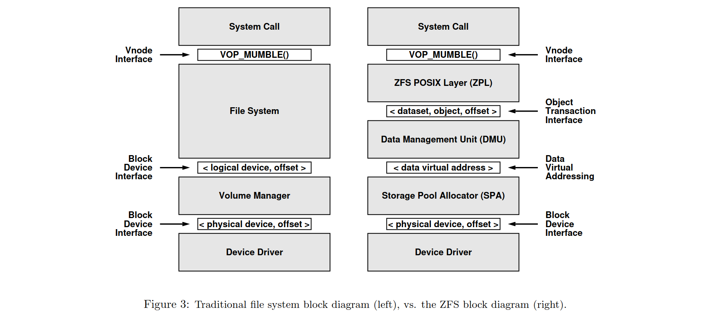
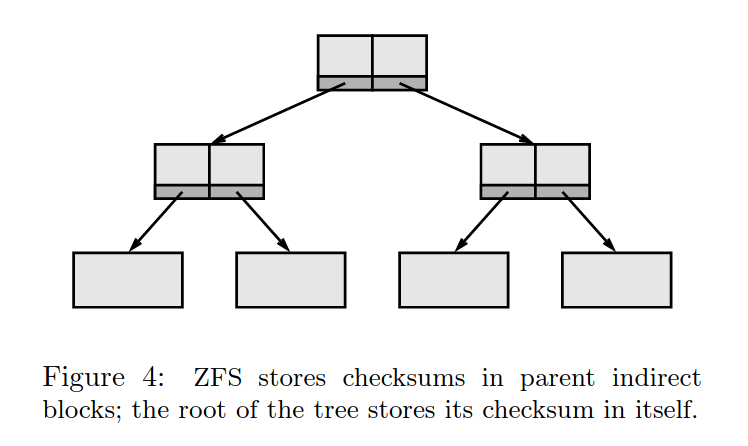
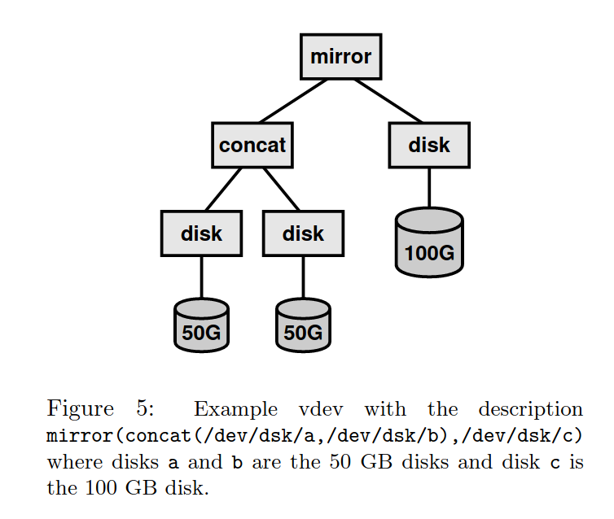
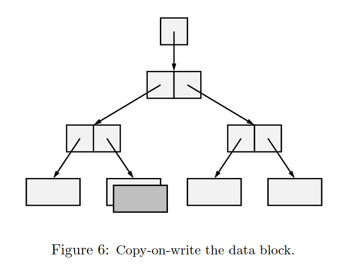
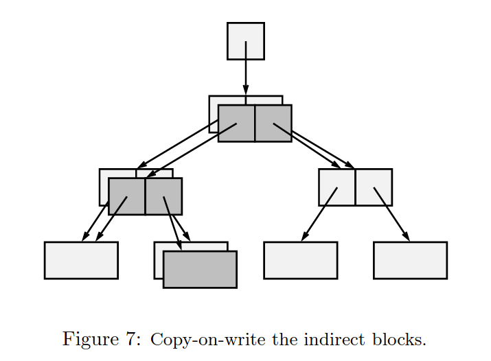
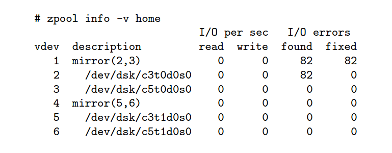

> 本文是阅读了[《The ZettaByte File System》](https://www.cs.hmc.edu/~rhodes/cs134/readings/The%20Zettabyte%20File%20System.pdf) 后所作的总结。

> 作者水平有限，如有错漏敬请斧正。

ZFS 文章是基于[前篇文章](/zfs-design-intro)所述设计思想所设计的通用型文件系统。ZFS 最初在 Solaris 操作系统上实现，作为一种通用型文件系统可应用于从桌面客户端到数据库服务器系统的种种情景中。本文将介绍 ZFS 的存储模型与基本架构。

## ZFS 存储模型
ZFS 相对于其他文件系统做出的最激进改变在于它重新设计了一套文件系统的分层结构。



传统的文件系统的架构类似左图。自底向上地来看，存储设备暴露一个块设备的接口给[卷管理器]^(Volume Manager)；卷管理器又提供一个虚拟块设备的接口给文件系统，最后文件系统将[虚拟节点]^(vnode)操作提供给操作系统调用。

而 ZFS 则如右图。同样是自底向上来看，ZFS 使用[存储池分配器]^(Storage Pool Allocator)（下文简称 `SPA`）而非卷管理器，SPA 负责块分配和 I/O 操作。存储设备仍然暴露一个块设备的接口给 SPA，但是 SPA 会向上层暴露成一个虚拟编址的、显式表明了块分配与否的一系列虚拟块给上层的[数据管理单元]^(Data Management Unit)(下文简称 `DMU`)，DMU 又将来自 SPA 的虚拟块封装成一个事务性的对象，通过接口提供给上层的 ZFS POSIX 层（下文简称 `ZPL`）。最终，ZPL 实现了一个 POSIX 文件系统接口，提供给上层的 POSIX 系统调用。

## [存储池分配器]^(Storage Pool Allocator)

SPA 并不和卷管理器一样提供一个虚拟块设备的接口，而是一个类似虚拟内存分配器的接口（类似 C 中的 `malloc()` 和 `free()`）。由 SPA 分配的数据块都有自己的[数据虚拟地址]^(data virtual address)，和实际在存储设备上的块地址是不同的。

使用虚拟地址令开发团队能更好地实现自己的设计原则：
1. 从存储池中动态增减存储设备不会中断系统服务
    只有 SPA 才知道虚拟地址和实际地址的对应关系。当向池中增加设备时，SPA 会立刻在新设备上进行块分配而不影响其他设备；当用户请求移除某块设备时（要讲武德，不能直接拔），SPA 会自动转移上面分配的数据块到其他设备上——这些数据的虚拟地址并不改变。因此在设备发生增减时，并不会影响上层的系统服务。
2. 简化管理
    系统管理员无需自己去管理各类逻辑卷或者存储分区，仅需说明自己想用啥设备。通常情况下一个文件系统可以用尽一个存储池中的每一块数据。如果有需要，管理员还可以为一个或一组文件系统设置存储的配额和保留量。
3. SPA 的保鲜期长
    使用 128 位虚拟地址，SPA 的每个存储池可以提供最大约 $2.56\times10^{38}$ 个数据块，支持数十万个文件系统的运行。据当时的物理知识来看，起码能满足数十年的需求。

### 错误检测与纠错


上篇文章已经说过，ZFS 不打算信任从磁盘读取到的数据，以期减少磁盘错误带来的文件系统崩溃。SPA 在写入数据块时也存储了数据块的校验和，保存在数据块的父节点上；[根结点]^(überblock)是唯一一个会存储自己的校验和的数据块。

分开存储使数据块和校验和同时损坏的概率降低了。如此设计也使得校验和更加可信，每一个结点的校验和同时都受到了上节点校验和的保证。（但是会不会造成每次写入都要把整个树枝上的节点都写一遍呢？）

同时，数据块的校验和也不用每次在一个特定的块里找。在树中读取非根节点的过程中，从根结点自上而下读取自然会将每个块都读入内存，在内存中得到每一层节点的校验和。

校验和的算法是可定制的。在某些情况下，校验和甚至可以具备纠错的功能。在存储没有完全损坏的情况下，当[存储池]^(zpool)做了镜像时，SPA 会自动读出未损坏的那一份并修复损坏的数据。

### [虚拟设备]^(Virtual Device)

SPA 也实现了通常的卷管理器的功能：[镜像]^(mirror)，[条带化]^(strip)，[拼接]^(concatenate)等。实现团队希望可以将这些功能和其他需求实现地轻量化。团队采用一种模块化的方法，通过实现不同的被称为 `vdev` 的虚拟设备。每一个 `vdev` 都可能有不同的子节点，可能是其他的 `vdev` 或者磁盘驱动程序，通过以上如镜像、拼接等方式组织组合成一个 `vdev`。



每个 `vdev` 只需约百来行代码即可实现，因为数据一致性是由上层实现的。每一个存储池可能包含了一个或多个虚拟设备。

### 块分配策略
SPA 使用一种类似轮流写入的策略，在一个包含了多个 `vdev` 的存储池中， SPA 倾向于将写入分散到那一组 vdev 中以增加写入带宽，读出则反之(就像一个天然的 RAID0?)。

当一个新的设备加入存储池后，SPA 立刻就会在新设备上进行块分配，同时读写的设备更多，又有了更大的磁盘带宽；而这一切并不需要管理员再来手动配置磁盘阵列。

SPA 使用一个派生自[Slab 分配器](https://people.eecs.berkeley.edu/~kubitron/courses/cs194-24-S14/hand-outs/bonwick_slab.pdf)的分配器。存储空间被分为许多特定大小的元数据块。为了方便实现写时拷贝机制，SPA 使用不等大的数据块大小（类似伙伴系统？）而非使用扩展机制（使用扩展机制带来的性能提升使用基于块的文件系统也可以达到）。

为了性能，写时拷贝的系统需要连续存储空间来写入新数据块，而 Slab 分配器已经被证明是可以很好地避免内存碎片的了。相比之下，结构化日志文件系统需要 512KB 或 1MB 的连续空闲空间来存储报文，而它的报文生成器具有相当大的开销，在某些情形下尤为明显。因此使用 Slab 分配器的算法是一个明智的选择。

## [数据管理单元]^(Data Management Unit)
DMU 将 SPA 的数据块封装成私有的对象（flat files)。私有对象是可以通过封装成事务性操作的调用进行创建、删除、读取、写入的数据集，通过一个64位数字进行识别并最多可以容纳 $2^{64}$ 字节的数据。

DMU 通过实现写时拷贝机制来保证数据完整性。每一次对数据块的修改新分配一个数据块并将修改后的数据写入新块中。

当在某一个叶子节点写入数据时，一个新的叶子节点会被分配，并写入修改过的内容。



由于新写入节点的位置和校验和都发生了改变，因此其亲节点也需要改变，亲节点需要变那么祖节点也需要改变...因此整条路径上的数据节点都需要重新写入。



到最后完成整个写入时，超级块并不会进行写时拷贝而是原地进行写入。当超级块写入成功时，整个树就自然地“切换”到了一个新的保证了数据完整性的状态，对文件系统进行操作的事务也完成了。
如果超级块写入失败了，DMU 会通过超级块自身的校验和发现写入出错，并使用超级块的备份进行恢复。由于超级块使用的是备份，指向的还是原树，因此依然保证了整个文件系统的完整性——只是本次事务失败了。

DMU 的设计实现又满足了 ZFS 的几个设计原则。首先是事务性的对象接口提供了在它的基础上实现的文件系统的一致性。在 ZFS 中，磁盘上的一致性一次性地通过 DMU 实现了。

DMU 的通用对象接口令文件系统动态的元数据分配实现起来更简单。当文件系统需要分配一个 inode 的时候，在 DMU 之上只需要创建一个对象并写入 inode 数据即可；不需要的时候直接删除，用户数据也是如此——这一切都是事务性的。

DMU 也方便了文件系统的创建和摧毁，简化了文件系统管理。DMU 上的每一个对象都有命名空间，每一个文件系统都可以在不同的命名空间下独立地创建和删除对象，因此多个文件系统可以简单地通过利用不同命名空间在同一块存储池上共存。

## [ZFS POSIX 层]^(ZFS POSIX Layer)

ZPL 实现了权限控制、 POSIX 系统调用和其他细节，使其看起来就像是一个 POSIX 文件系统。ZPL 使用 DMU 来存储其所有数据。文件操作会被 ZPL 打包成一系列事务，在事务完成之后盘上的数据依然是一致的。只要 ZPL 将操作正确打包了，那么即使系统崩溃也无需担心磁盘数据的一致性。

ZFS 不使用 `mkfs` 程序来创建新的文件系统，ZFS 自己就有这样的功能，只需要在 DMU 上多建立几个对象描述元数据，就能在常数时间复杂度内建立一个新的文件系统。在其他的操作系统或者文件系统中想要建立一个新的文件系统是相当困难的，比如需要 umount 一个磁盘然后再在上面用 GParted 之类的程序进行重新分区，然后再 mount（还得担心误操作扬了自己的系统），在ZFS中就完全不用担心这种问题。

当然，如果在写入提交的几秒内（还没来得及落到下层）的时候系统崩溃了写入也可能丢失。为了防止这种情况，ZPL 实现了[待办日志]^(intent log)记录已经提交的事务。只需要将待办日志持久化到磁盘或者持久内存即可。

## ZFS 实践
上面洋洋洒洒写了几千字，可以看出 ZFS 的设计之精妙。但是 ZFS 的到底如何还是得经过实践检验。

实现团队决定从三方面来检验：
- 管理便利性
- 存储虚拟化
- 坏数据修复

### 管理便利性与存储虚拟化
创建一个存储池，并在上面建立几个 ZFS 文件系统
```bash
# create storage pool named "home" using a mirror of two disks
zpool create home mirror /dev/dsk/c3t0d0s0 /dev/dsk/c5t0d0s0

zpool info home
# Pool      size    used    avail   capability
# home      80G     409M    80G     1%

# use -c to create file system
zfs mount -c home/user1 /export/home/user1
zfs mount -c home/user2 /export/home/user2
zfs mount -c home/user3 /export/home/user3

# verify that they are mounted
df -h -F zfs
# Filesystem        size    used    avail   use%    Mounted on
# home/user1        80G 4K  80G 1%  /export/home/user1
# home/user2        80G 4K  80G 1%  /export/home/user2
# home/user3        80G 4K  80G 1%  /export/home/user3
```

添加存储硬件，展示 ZFS 是否迅速开始使用新的存储

```bash
# add hardware /dev/dsk/c5t1d0s0
zpool add home mirror /dev/dsk/c3t1d0s0 /dev/dsk/c5t1d0s0

df -h -F zfs
# Filesystem    size    used    avail use% Mounted on
# home/user1    160G    4K      160G    1%  /export/home/user1 
# home/user2    160G    4K      160G    1%  /export/home/user2 
# home/user3    160G    4K      160G    1%  /export/home/user3
```

可以看出来 ZFS 确实迅速启用了新的存储，且存储对所有文件系统可用。

### 坏数据修复
向文件系统中拷贝几个文件，并对镜像中的一个磁盘中写入随机数据以模拟数据损坏。

```bash
cp /usr/bin/e* /export/home/user1
dd if=/dev/urandom of=/dev/dsk/c3t0d0s0 count=10000
# 10000+0 records in
# 10000+0 records out
```

然后进行 diff 检查是否出现文件损坏。
```bash
diff /usr/bin/emacs /export/home/user1/emacs
# can't find `/usr/bin/emacs`, do you mean /usr/bin/nvim?
diff /usr/bin/erl /export/home/user1/erl
# [...]
```
发现没有出现损坏，经过检查发现 ZFS 自己修复了磁盘错误。



## 设计上的取舍
这篇论文中，团队专注于提高 ZFS 的数据一致性、可恢复性和易管理性，并未太多专注于 ZFS 的性能。在这里简要介绍他们在设计上的取舍。

使用写时拷贝算法要求更高明的分配算法，且在整个盘快满时可能会发生反直觉的空间不足的问题。

牺牲部分性能用于实现每个数据块的校验和，不过在更高的处理器性能和硬件加密加速下应该不是问题（反正没有什么比磁盘转起来更慢不是么）。也可以使用更快的校验算法。
校验和也不总是会拉低性能。在某些情况下比如两个磁盘镜像不同步的时候，使用校验和可以检查哪些块是正确的，并且只针对性地拷贝树的一部分而非直接完全拷贝，从而大大提升恢复性能。

另外作者们并没有牺牲简便性来实现更多功能，由此 ZFS 的实现（在这篇论文中）更加简单。ZFS 有 25,000 行的内核代码和 2,000 行的用户代码，实现了卷管理器到文件系统，以及类似 `fsck`、`mkfs` 等软件的部分功能；相比之下，Solaris UFS 与 SVM 加起来共有 90,000 行内核代码和 105,000 行用户代码，ZFS 的代码行数相比之下只有 1/7。XFS 在 1997 年也有超过 70,000 行代码。

## 相关工作

其实相比于 ZFS，[WAFL]^(Write Anywhere File Layout) 更接近于 ZFS 的设计思想。WAFL 是首个使用 CoW 树的商业性文件系统，并且在文件层面而非块层面记录日志；ZFS 使用了池化存储而 WAFL 并没有；WAFL 用一个文件记录所有块的校验和而 ZFS 中每个块都有校验和；ZFS是一个 POSIX 文件系统，而WAFL 只能在部分网络应用中使用。

XFS 和 JFS 都动态分配 inode，但是并没有为其他类型数据的动态分配提供一个通用的对象接口。而 Episode 允许多个文件系统同时存在同一个分区上，类似 ZFS 的池化存储。

ZFS 从数据库、密码学和其他研究领域借鉴了多种方法，它的真正贡献是集百家之成，实现了一个具有池化存储、所有数据块的事务性的写时拷贝、基于对象的存储模型、自我验证的校验和，等特性的通用的 POSIX 文件系统。

## 未来的工作
ZFS 打开了新世界的大门，比如数据库可以直接使用 DMU 的各种事务性的操作；文件系统也可以任意地在 DMU 的基础上设计—— ZPL 由两人在 6 周内完成开发；如果解决了密钥管理基础设施的问题，在数据块的层面实现加密就是小菜一叠了。在 ZFS 上文件系统非常经济且创建方便，所以使用文件系统作为系统管理、加密、压缩等的基本单元是有可能的。在ZFS内部的块分配算法上也有很多工作可以做。

## 工作状态与总结
ZFS 的项目起步于 2002 年 1 月，计划在 2004 年发布第一个快照版本。

## 论文总结
ZFS 瞄准了当时文件系统存在的几大问题：管理复杂、低数据一致性保证、有限的容量。ZFS 通过池化存储、将块分配任务从文件系统移动到 SPA、基于对象的存储模型、对所有数据块的校验以及 128 位的虚拟地址。

当时的实现非常简便，可以说麻雀虽小五脏俱全，从 SPA 到 ZPL 囊括其中。ZFS 的数据一致性、容量和管理简便性令人印象深刻，是文件系统的标杆。

## 感想
~~总算是水了两篇博文~~ ZFS 的实现高屋建瓴，模块功能划分清明，论文语言平实，令人印象深刻。尤其是需求明确，针对几个缺点，可以做到自己重新划个新栈出来，难怪会夸口说是“The last world in file system”。

~~等有钱了我也组一台 NAS 玩玩 ZFS~~
