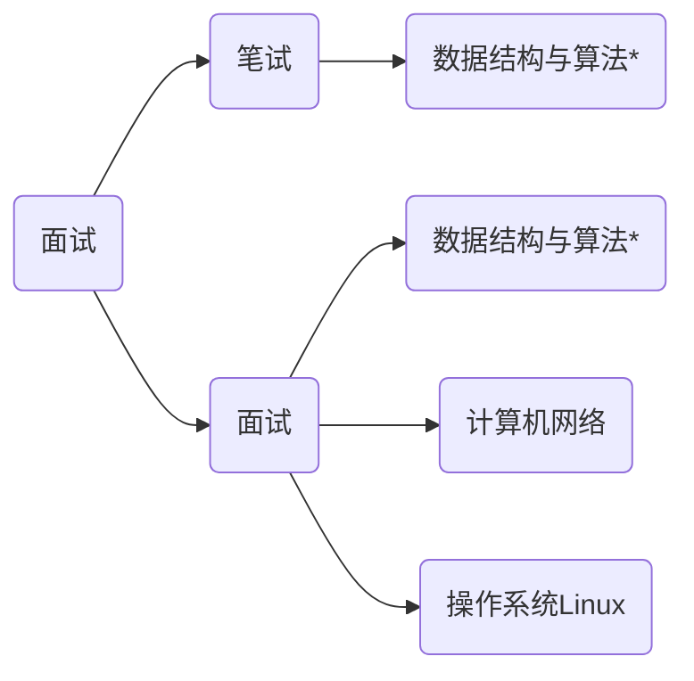

# new_home


## 迁移 <sub><small><small>直接跑路</small></small></sub>

又一次一时兴起, 这次惨遭毒手的是 `vercel` + `github` + `hugo`.

不说了, 静态博客真香, <abbr>`LNMP`</abbr> 还是不适合懒人.

## 新博客功能演示

数学公式：
$$
    F(f) = \int_{-\infty}^{\infty}{f(t)e^{-j2{\pi}ft}}{\rm d}t
$$

代码演示：

```haskell
-- font: sarasa-mono-sc
-- using it to get better support for East Asian Characters especially Simplified Chinese.
-- use haskell because it's beautiful
-- and also can show whether you got font ligatures.

quicksort1 :: (Ord a) => [a] -> [a]
quicksort1 [] = []
quicksort1 (x:xs) =
    let smallerSorted = quicksort1 [a | a <- xs, a <= x]
        biggerSorted = quicksort1 [a | a <- xs, a > x]
    in  smallerSorted ++ [x] ++ biggerSorted

```

```c
#include<stdio.h>

int
main(int *argc, char **argv)
{
    printf("%s, %s\n", argv[1], argv[2]);
    printf("输入两参数如上↑\n");
    // 你可以发现中英文完全对齐
    // 只是英文好挤好怪啊（恼
    return 0;
}
```

flow chart:

```flow
    st=>start: Start
    op=>operation: Your Operation
    cond=>condition: Yes or No?
    e=>end

    st->op->cond
    cond(yes)->e
    cond(no)->op
```

sequence diagrams:

```sequence
    Client->Server: 你有 10492 的资源嘛？
    Note right of Server: 稍加思索...
    Server->Client: "http:200 OK:{state: 404}"
```

mermaid: 



